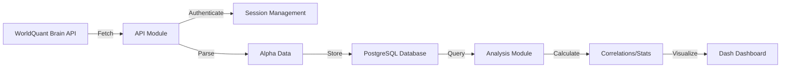

# Claude Code Project Instructions

## 🎯 Project Overview

**AlphaDataBank** is a comprehensive data pipeline and analytics platform for alphas from WorldQuant Brain.

### Purpose
- **Fetch** trading strategies (alphas) from WorldQuant Brain API
- **Store** alpha metadata and performance (PNL) data in PostgreSQL
- **Calculate** cross-correlations between strategies to identify uniqueness
- **Analyze** alpha expressions to understand operator/datafield usage patterns
- **Visualize** results through interactive Dash/Plotly dashboards

### Target Users
- Worldquant brain consultants to help them better analyse - have a feel of their alphas without always keeping a perfect record of their alphas

## 🏗️ Architecture & Technology Stack

### Core Technologies
- **Language**: Python 3.x
- **Database**: PostgreSQL (time-series PNL storage)
- **Performance**: Cython (compiled C extensions for 10-100x faster correlations)
- **Web Framework**: Dash + Plotly (interactive visualizations)
- **Data Processing**: Pandas, NumPy, scikit-learn
- **ML/Clustering**: UMAP for dimensionality reduction
- **API Client**: Requests with custom session management
- **Database ORM**: SQLAlchemy + psycopg2

### Technology Decisions & Rationale

#### Why PostgreSQL?
- Efficient time-series storage for millions of PNL data points
- ACID compliance for financial data integrity
- Supports complex joins for correlation analysis
- Scalable for 10+ regions × thousands of alphas

#### Why Cython for Correlations?
- Python loops are 100-1000x slower for numerical operations
- Correlation calculation is O(n²) - needs optimization
- Cython compiles to C, achieving near-C performance
- Critical for calculating millions of pairwise correlations

#### Why Dash Instead of Static Reports?
- Interactive filtering by region/universe/delay
- Real-time updates as new alphas are added
- Web-based - accessible from any device
- No need for separate frontend development

## 📁 Project Structure

```
alphaDataBank/
├── api/                      # WorldQuant Brain API integration
│   ├── alpha_fetcher.py      # Fetch submitted alphas & PNL data
│   ├── auth.py               # Authentication & session management
│   └── unsubmitted_fetcher.py # Fetch unsubmitted/failed alphas
│
├── database/                 # Database layer
│   ├── schema.py            # Table definitions & initialization
│   ├── operations.py        # CRUD operations for alphas
│   └── operations_unsubmitted.py # Unsubmitted alpha operations
│
├── scripts/                  # Main execution scripts
│   ├── run_alpha_databank.py # Main entry point
│   ├── calculate_cross_correlation.py # ✅ ACTIVE correlation calculator
│   ├── update_correlations_optimized.py # Batch correlation updates
│   └── init_database.py     # Database setup
│
├── analysis/                 # Analytics & visualization
│   ├── alpha_expression_parser.py # Parse alpha code expressions
│   ├── analysis_operations.py # Database queries for analysis
│   └── clustering/          # UMAP clustering visualization
│       ├── clustering_analysis.py
│       └── visualization_server.py
│
├── config/                   # Configuration
│   ├── database_config.py   # DB connection settings
│   └── api_config.py        # API endpoints & parameters
│
├── data/                     # Data files for analysis
│   ├── operators_dynamic.json.txt        # List of all operators
│   └── datafields_dynamic.csv # All available datafields
│
├── utils/                    # Utility functions
│   └── helpers.py           # Logging, formatting utilities
│
├── secrets/                  # Authentication & credentials (gitignored)
│   ├── session_cookies.json # Cached session cookies
│   └── platform-brain.json  # WorldQuant Brain credentials
│
├── ace.py                   # Authentication module
├── helpful_functions.py     # Helper functions for ace.py
├── correlation_utils.pyx     # Cython module for fast correlation
├── run_analysis_dashboard.py # Dashboard entry point
├── setup.py                 # Cython build configuration
└── requirements.txt         # Python dependencies
```

## 🔄 Data Flow Architecture



## 🐛 Current Issues & Refactoring Opportunities

### Refactoring Opportunities

#### 1. Consolidate Correlation Scripts
- **Problem**: 5 different correlation scripts with overlapping functionality
- **Solution**: Merge into single module with configuration flags
- **Files to consolidate**:
  - `calculate_self_correlation_*.py` (4 unused variants)
  - Keep only `calculate_cross_correlation.py`

#### 2. Restructure Root Directory
- **Problem**: 15+ Python files in root causing confusion
- **Solution**: Organize by function:
  ```
  legacy/         # Move unused scripts (ace.py, etc.)
  docs/           # Move *.md files except README
  ```

#### 3. Improve Configuration Management
- **Problem**: Hardcoded paths in some modules
- **Solution**: 
  - Create `config/settings.py` with all paths
  - Use environment variables consistently
  - Centralize all configuration

#### 4. Enhance Error Handling
- **Problem**: Silent failures in API calls, unclear error messages
- **Solution**:
  - Add retry decorators with exponential backoff
  - Implement proper logging hierarchy
  - Create custom exception classes

#### 5. Optimize Database Schema
- **Problem**: Separate tables per region causing complex queries
- **Solution**:
  - Consider single PNL table with region column
  - Add indexes for common query patterns
  - Implement table partitioning for scale

## 🔧 Development Guidelines

### Virtual Environment Setup (REQUIRED)
```bash
# Scripts depend on venv location - must use venv!
python -m venv venv
venv\Scripts\activate  # Windows
pip install -r requirements.txt
```

### Compile Cython Module (For Performance)
```bash
# Install C++ compiler first (see README)
python setup.py build_ext --inplace
```

### Database Initialization
```bash
# Create tables and indexes
python scripts/init_database.py
```

### Fetching Data Workflow
1. **Authenticate**: Session stored in `.session_cookies`
2. **Fetch Alphas**: Metadata for each region
3. **Fetch PNL**: Historical performance data
4. **Calculate Correlations**: Pairwise comparisons
5. **Store Results**: PostgreSQL for persistence

## 🚀 Quick Start Commands

```bash
# Fetch all submitted alphas (authentication now works on first try!)
python scripts/run_alpha_databank.py --all

# Fetch unsubmitted alphas
python scripts/run_alpha_databank.py --unsubmitted --url "..." --all

# Run analytics dashboard
python run_analysis_dashboard.py

# Calculate correlations
python scripts/calculate_cross_correlation.py --region USA --limit 100
```

## 🔍 Search Tool Preferences

**ALWAYS use `rg` (ripgrep) via Bash tool instead of Grep tool for code searches.**

The Grep tool frequently gets cancelled/interrupted in this codebase environment. Use these reliable patterns:

- File search: `rg -l "pattern" /path --type py`
- Content search: `rg "pattern" /path --type py` 
- Context search: `rg -A 5 -B 5 "pattern" /path`

## 📊 Key Workflows Explained

### Alpha Correlation Calculation
1. Fetch PNL data for two alphas
2. Calculate daily returns from cumulative PNL
3. Compute Pearson correlation of returns
4. Store min/max/avg/median correlations per alpha
5. Use Cython for 100x speedup on large datasets

### Expression Analysis Pipeline
1. Parse alpha code using regex patterns
2. Extract operators (180+ mathematical functions)
3. Extract datafields (1000+ market data fields)
4. Group by categories (price, volume, fundamental)
5. Visualize usage patterns in dashboard

## 🎯 Project Goals & Vision

### Short-term Goals
- Fix authentication retry bug
- Consolidate duplicate scripts
- Improve error handling

## 📝 Notes for Developers

- **Virtual environment recommended** - ensures dependency compatibility and isolation
- **Run scripts from project root** - relative imports will break otherwise
- **Check logs in database operations** - silent failures are common
- **Use optimized functions** - `_optimized` variants are 10-100x faster
- **Test with small datasets first** - full correlation matrix can take hours