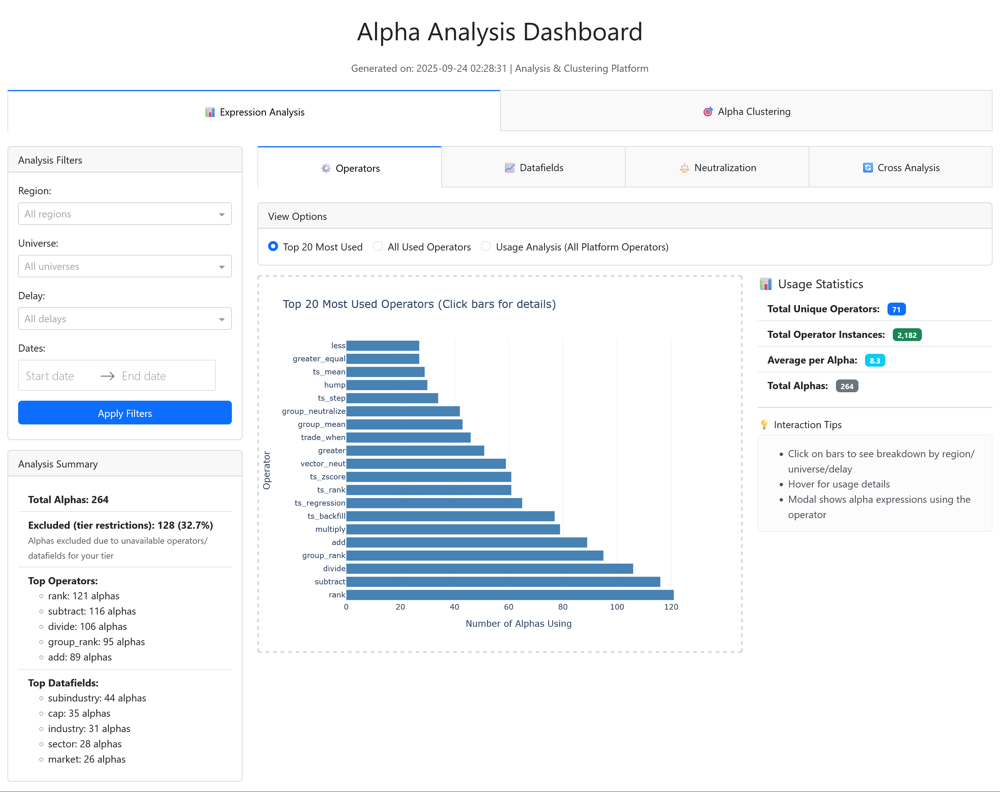
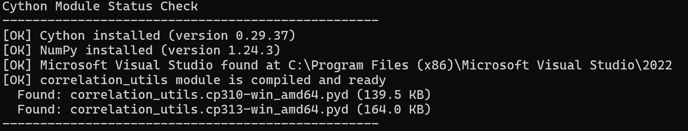
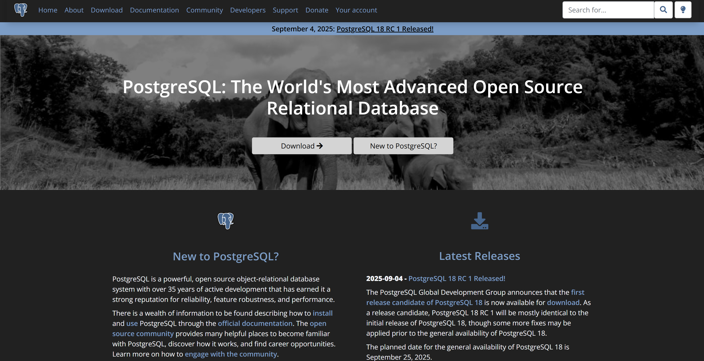
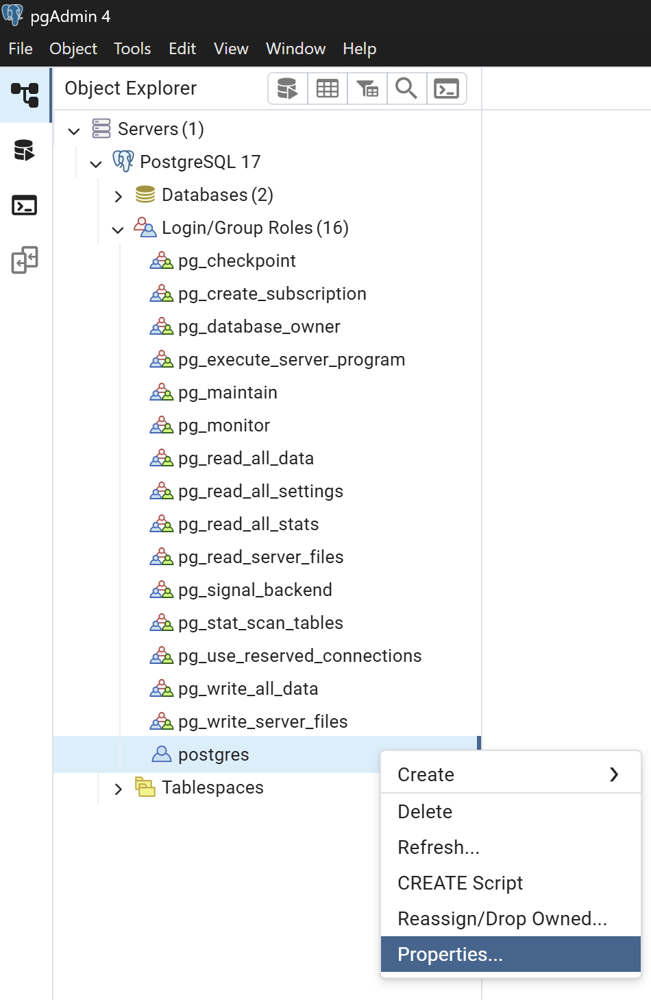

# Alpha DataBank

A PostgreSQL-based system for tracking and analyzing WorldQuant Brain alphas.

## Requirements

- **Python 3.8+** (3.10+ recommended)
- **PostgreSQL 12+**
- **C++ Compiler** (for Cython optimization)
- **8GB+ RAM** (16GB recommended for large datasets)

## Use Case

- Dashboard Visualization



## Setup

### 1. Install Requirements

**Recommended: Use a Virtual Environment**

We strongly recommend using a virtual environment to avoid dependency conflicts and ensure compatibility with your system's other Python projects.

#### Option A: Traditional Setup

Create the virtual environment:
```bash
python -m venv venv
```

Activate the virtual environment:

**On Windows:**
```bash
venv\Scripts\activate
```

**On macOS/Linux:**
```bash
source venv/bin/activate
```

Install the required packages:
```bash
pip install -r requirements.txt
```

#### Option B: Fast Setup with uv (10-100x faster)

[uv](https://github.com/astral-sh/uv) is a blazingly fast Python package manager written in Rust.

**Install uv:**
```bash
pip install uv
```

**Create virtual environment and install packages:**
```bash
uv venv
```

**Activate the virtual environment:**

**On Windows:**
```bash
.venv\Scripts\activate
```

**On macOS/Linux:**
```bash
source .venv/bin/activate
```

**Install packages with uv:**
```bash
uv pip install -r requirements.txt
```

### 2. Cython Module (Automatic Compilation)

**⚠️ Important: A C++ compiler is required for Cython compilation. The module will attempt to compile automatically on first run.**

This project uses a Cython extension (`correlation_utils.pyx`) to provide huge speedup for correlation calculations.

**C++ Compiler Installation:**

Ensure you have a C++ compiler installed on your system:

*   **On Windows:**
    1.  Download the **Visual Studio Build Tools** from the [official Microsoft site](https://visualstudio.microsoft.com/visual-cpp-build-tools/).
    2.  Run the installer. In the "Workloads" tab, check the box for **"Desktop development with C++"** and click "Install".

*   **On macOS:**
    Open the Terminal and run:
    ```bash
    xcode-select --install
    ```

*   **On Linux (Debian/Ubuntu):**
    Open the Terminal and run:
    ```bash
    sudo apt update && sudo apt install build-essential
    ```

**Manual Compilation (optional - skip on first run):**

**💡 You can skip this on first setup - the module compiles automatically when you run the application.**

If auto-compilation doesn't work, you can manually compile:
```bash
# Check Cython status
python utils/cython_helper.py



# Manual compile
python setup.py build_ext --inplace
```

### 3. PostgreSQL Setup

- Install [PostgreSQL](https://www.postgresql.org/) (the Windows installer includes pgAdmin).



- For database management, use [pgAdmin](https://www.pgadmin.org/) (included with Windows installer, separate download for Mac/Linux) or any PostgreSQL client like [DBeaver](https://dbeaver.io/), TablePlus, or DataGrip.
- **Note:** The database will be created automatically when you run `python run_alpha_databank.py` (no manual creation needed).

### 4. Configure Environment Variables

#### Database Configuration

1. Copy the example environment file:
   ```bash
   cp .env.example .env
   ```

2. Edit `.env` and update with your PostgreSQL credentials:
   ```env
   DB_USER=postgres
   DB_PASSWORD=your_password_here  # ← Usually only this needs changing
   DB_HOST=localhost
   DB_PORT=5432
   DB_NAME=alpha_database
   ```

   **Forgot your PostgreSQL password?**
   - **Windows:** The password was set during PostgreSQL installation. If forgotten, you can reset it in pgAdmin by right-clicking on the "postgres" user → Properties → Definition tab → Password field.

   

   - **Mac/Linux:** You can reset it via terminal: `sudo -u postgres psql -c "ALTER USER postgres PASSWORD 'new_password';"`
   - **Video Tutorial:** [How to Reset PostgreSQL Password](https://www.youtube.com/watch?v=-GzyP0G4t88)

#### WorldQuant Brain API Credentials

1. Copy the example credentials file from the secrets directory:
   ```bash
   cp secrets/platform-brain.json.example secrets/platform-brain.json
   ```

2. Edit `secrets/platform-brain.json` with your WorldQuant Brain credentials:
   ```json
   {
       "email": "your_email@example.com",
       "password": "your_brain_password"
   }
   ```

## Usage

**Run commands in order: fetch data first, then visualize.**

### 1. Fetch All Submitted Alphas
```bash
python run_alpha_databank.py --all
```

### 2. Refresh Operators & Datafields
```bash
python renew_genius.py
```

This fetches operators and datafields based on your WorldQuant Brain tier access. Only alphas using operators/datafields available to your tier are displayed in the dashboard.

### 3. Generate Clustering Data
```bash
python refresh_clustering.py
```

### 4. Run Analytics Dashboard

#### Option 1: Production Mode (Recommended - Fast)

**Windows:**
```bash
waitress-serve --host=127.0.0.1 --port=8050 wsgi:server
```

**Linux/Mac:**
```bash
gunicorn -w 4 -b 127.0.0.1:8050 wsgi:server
```

#### Option 2: Development Mode (Simple, but slower)
```bash
python run_analysis_dashboard.py
```
**Note:** You'll see a warning about using the development server. This mode is slower than production mode and should only be used for testing.

#### Additional Commands

**Regular Maintenance Workflow (run in this order):**
```bash
# 1. Refresh operators/datafields (when genius tier changes)
python renew_genius.py

# 2. Fetch new alpha data (after submitting new alphas)
python run_alpha_databank.py --all

# 3. Refresh clustering (to include new alphas)
python refresh_clustering.py

# 4. Clear analysis cache (to reprocess with new data)
python clear_cache.py
```

**Development mode equivalents:**
```bash
# Refresh operators/datafields (same as renew_genius.py)
python run_analysis_dashboard.py --renew

# Clear cache only (same as clear_cache.py)
python run_analysis_dashboard.py --clear-cache
```

**Notes:**
- The analysis dashboard excludes super alphas and only visualizes regular alphas for analysis
- Alphas containing operators or datafields not available to your tier are automatically excluded from all statistics and visualizations

### 3. Fetch Unsubmitted Alphas (Optional, link below is an example, use your own links that contain the alphas you want from the brain platform alphas filter page - you can get it by inspecting the network)
```bash
python run_alpha_databank.py --unsubmitted --url "https://api.worldquantbrain.com/users/self/alphas?limit=50&offset=9800&status=UNSUBMITTED%1FIS_FAIL&order=-dateCreated&hidden=false" --all
```

## Documentation

- **[Technical Documentation](TECHNICAL_DOCUMENTATION.md)** - System architecture and design principles
- **[Scripts & Commands](SCRIPTS_AND_COMMANDS.md)** - Detailed command reference